# EX 06 Feature Transformation

## AIM:

To Perform the various feature transformation techniques on a dataset and save the data to a file. 

## EXPLANATION:

Feature Transformation is a mathematical transformation in which we apply a mathematical formula to a particular column(feature) and transform the values which are useful for our further analysis.

## ALGORITHM:

### STEP 1:
Read the given Data.
### STEP 2:
Clean the Data Set using Data Cleaning Process.
### STEP 3:
Apply Feature Transformation techniques to all the feature of the data set.
### STEP 4:
Save the data to the file.

## CODE:

Program Developed: Paarkavy B
Register number:212221230072

## DATA TO TRANSFORM.csv:

```
# importing packages
import numpy as np
import pandas as pd
import matplotlib.pyplot as plt
import seaborn as sns
import statsmodels.api as sm
import scipy.stats as stats
from sklearn.preprocessing import QuantileTransformer 
qt=QuantileTransformer(output_distribution='normal')

df=pd.read_csv("Data_to_Transform.csv")
df

#checking and analysing the data
df.isnull().sum()

#checking for skewness of data
df.skew()

#applying data transformations
dfmp=pd.DataFrame()
#for Moderate Positive Skew
#function transformation
dfmp["Moderate Positive Skew"]=df["Moderate Positive Skew"]
dfmp["MPS_log"]=np.log(df["Moderate Positive Skew"]) 
dfmp["MPS_rp"]=np.reciprocal(df["Moderate Positive Skew"])
dfmp["MPS_sqr"]=np.sqrt(df["Moderate Positive Skew"])
#power transformation
dfmp["MPS_yj"], parameters=stats.yeojohnson(df["Moderate Positive Skew"])
dfmp["MPS_bc"], parameters=stats.boxcox(df["Highly Positive Skew"]) 
#quantile transformation
dfmp["MPS_qt"]=qt.fit_transform(df[["Moderate Positive Skew"]])
dfmp.skew()

dfmp.drop('MPS_rp',axis=1,inplace=True)
dfmp.skew()

dfmp

#for Highly Positive Skew
#function transformation
dfhp=pd.DataFrame()
dfhp["Highly Positive Skew"]=df["Highly Positive Skew"]
dfhp["HPS_log"]=np.log(df["Highly Positive Skew"]) 
dfhp["HPS_rp"]=np.reciprocal(df["Highly Positive Skew"])
dfhp["HPS_sqr"]=np.sqrt(df["Highly Positive Skew"])
#power transformation
dfhp["HPS_yj"], parameters=stats.yeojohnson(df["Highly Positive Skew"])
dfhp["HPS_bc"], parameters=stats.boxcox(df["Highly Positive Skew"]) 
#quantile transformation
dfhp["HPS_qt"]=qt.fit_transform(df[["Highly Positive Skew"]])
dfhp.skew()

dfhp.drop('HPS_sqr',axis=1,inplace=True)
dfhp.skew()

dfhp

#for Moderate Negative Skew
dfmn=pd.DataFrame()
#function transformation
dfmn["Moderate Negative Skew"]=df["Moderate Negative Skew"]
dfmn["MNS_rp"]=np.reciprocal(df["Moderate Negative Skew"])
dfmn["MNS_sq"]=np.square(df["Moderate Negative Skew"])
#power transformation
dfmn["MNS_yj"], parameters=stats.yeojohnson(df["Moderate Negative Skew"]) 
#quantile transformation
dfmn["MNS_qt"]=qt.fit_transform(df[["Moderate Negative Skew"]])
dfmn.skew()

dfmn.drop('MNS_rp',axis=1,inplace=True)
dfmn.skew()

dfmn

#for Highly Negative Skew
dfhn=pd.DataFrame()
#function transformation
dfhn["Highly Negative Skew"]=df["Highly Negative Skew"]
dfhn["HNS_rp"]=np.reciprocal(df["Highly Negative Skew"])
dfhn["HNS_sq"]=np.square(df["Highly Negative Skew"])
#phwer transformation
dfhn["HNS_yj"], parameters=stats.yeojohnson(df["Highly Negative Skew"]) 
#quantile transformation
dfhn["HNS_qt"]=qt.fit_transform(df[["Highly Negative Skew"]])
dfhn.skew()

dfhn.drop('HNS_rp',axis=1,inplace=True)
dfhn.skew()

dfhn

#graphical representation
#for Moderate Positive Skew
df["Moderate Positive Skew"].hist()
dfmp["MPS_log"].hist()
dfmp["MPS_sqr"].hist()
dfmp["MPS_bc"].hist()
dfmp["MPS_yj"].hist()
sm.qqplot(df['Moderate Positive Skew'],line='45')
plt.show()
sm.qqplot(dfmp['MPS_qt'],line='45')
plt.show()

#for Highly Positive Skew
df["Highly Positive Skew"].hist()
dfhp["HPS_log"].hist()
dfhp["HPS_rp"].hist()
dfhp["HPS_bc"].hist()
dfhp["HPS_yj"].hist()
sm.qqplot(df['Highly Positive Skew'],line='45')
plt.show()
sm.qqplot(dfhp['HPS_qt'],line='45')
plt.show()

#for Moderate Negative Skew
df["Moderate Negative Skew"].hist()
dfmn["MNS_sq"].hist()
dfmn["MNS_yj"].hist()
sm.qqplot(df['Moderate Negative Skew'],line='45')
plt.show()
sm.qqplot(dfmn['MNS_qt'],line='45')
plt.show()

#for Highly Negative Skew
df["Highly Negative Skew"].hist()
dfhn["HNS_sq"].hist()
dfhn["HNS_yj"].hist()
sm.qqplot(df['Highly Negative Skew'],line='45')
plt.show()
sm.qqplot(dfhn['HNS_qt'],line='45')
plt.show()
```

## TITANIC DATASET.csv:
```
# importing packages
import numpy as np
import pandas as pd
import matplotlib.pyplot as plt
import seaborn as sns
import statsmodels.api as sm
import scipy.stats as stats
from sklearn.preprocessing import QuantileTransformer 
qt=QuantileTransformer(output_distribution='normal',n_quantiles=891)

df=pd.read_csv("titanic_dataset.csv")
df

#checking and analysing the data
df.isnull().sum()
# cleaning data
df.drop('Cabin',axis=1,inplace=True)
df.drop('Name',axis=1,inplace=True)
df.drop('Ticket',axis=1,inplace=True)
df.drop('PassengerId',axis=1,inplace=True)
df['Age']=df['Age'].fillna(df['Age'].median())
df['Embarked']=df['Embarked'].fillna(df['Embarked'].mode()[0])
df.isnull().sum()
#encoding categorical data
from sklearn.preprocessing import OrdinalEncoder
embark=["C","S","Q"]
emb=OrdinalEncoder(categories=[embark])
df["Embarked"]=emb.fit_transform(df[["Embarked"]])

from category_encoders import BinaryEncoder
be=BinaryEncoder()
df["Sex"]=be.fit_transform(df[["Sex"]])
df.skew()

#feature in 0.5 to -0.5 range: Embarked Survived Age (A,S pos)(E neg)
#features that are in skew
#neg:Pclass 
#pos:Sex SibSp Parch Fare 
df["Age_1"]=qt.fit_transform(df[["Age"]])
df["Survived_1"]=qt.fit_transform(df[["Survived"]])
df["Embarked_1"]=qt.fit_transform(df[["Embarked"]])
df["Pclass_sq"]=np.square(df["Pclass"])
df["Pclass_qt"]=qt.fit_transform(df[["Pclass"]])
df["SibSp_yj"], parameters=stats.yeojohnson(df["SibSp"])
df["SibSp_qt"]=qt.fit_transform(df[["SibSp"]])

df["Parch_yj"], parameters=stats.yeojohnson(df["Parch"])
df["Parch_qt"]=qt.fit_transform(df[["Parch"]])

df["Fare_yj"], parameters=stats.yeojohnson(df["Fare"])
df["Fare_qt"]=qt.fit_transform(df[["Fare"]])

df["Sex_yj"], parameters=stats.yeojohnson(df["Sex"])
df["Sex_qt"]=qt.fit_transform(df[["Sex"]])
df.skew()

#taking closer to range skew values
df.drop('Sex_yj',axis=1,inplace=True)
df.drop('Pclass_qt',axis=1,inplace=True)
df.drop('SibSp_qt',axis=1,inplace=True)
df.drop('Parch_qt',axis=1,inplace=True)
df.drop('Fare_qt',axis=1,inplace=True)
df.skew()

#graph representation
df["Sex"].hist()
df["Sex_qt"].hist()
df["SibSp"].hist()
df["SibSp_yj"].hist()
df["Parch"].hist()
df["Parch_yj"].hist()
df["Fare"].hist()
df["Fare_yj"].hist()
df["Pclass"].hist()
df["Pclass_sq"].hist()
```

## OUTPUT:

## DATA TO TRANSFORM.csv:

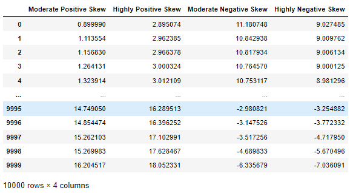

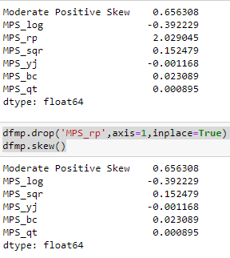
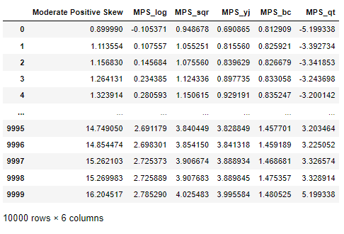
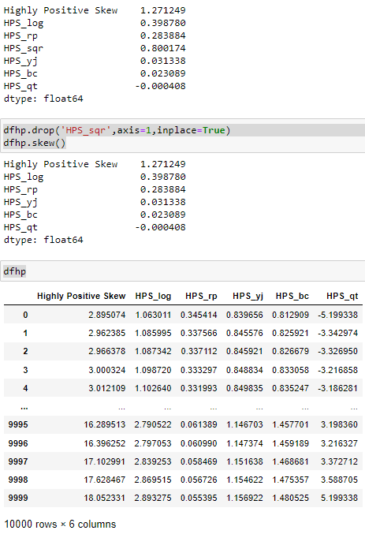
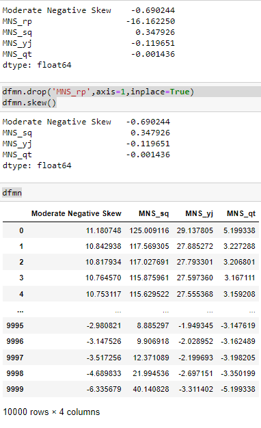
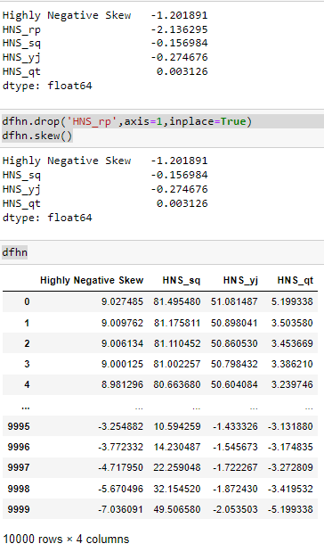

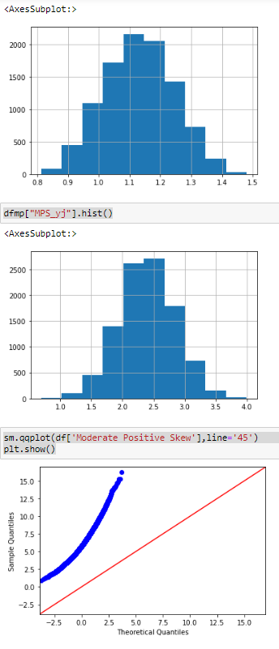

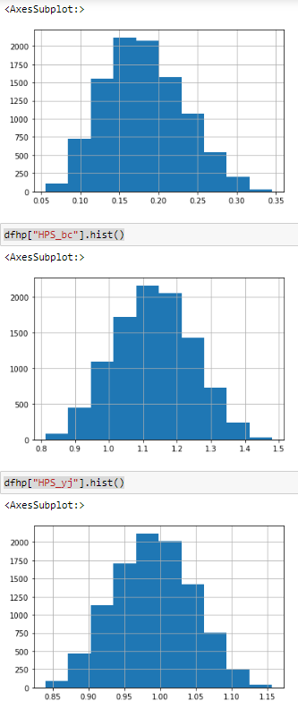
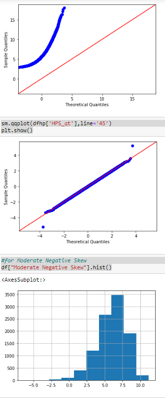
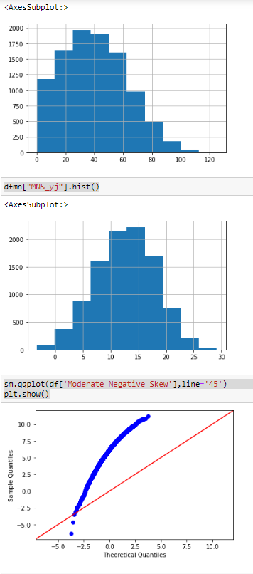
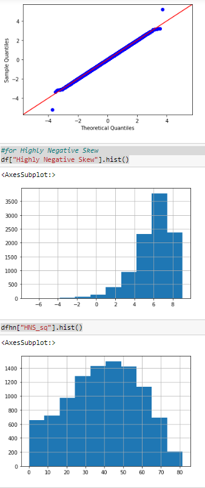


## TITANIC DATASET.csv:

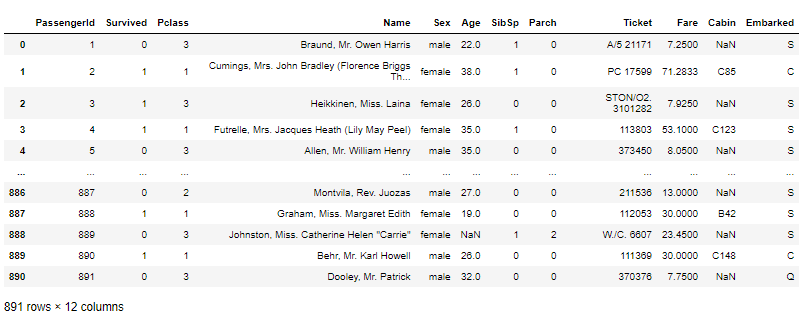
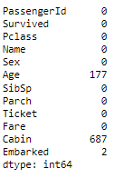

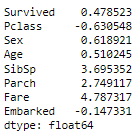


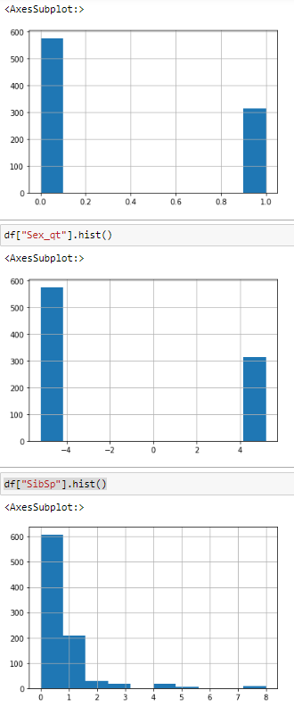

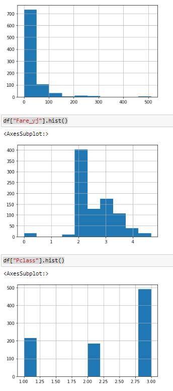


## RESULT:
The various feature transformation techniques has been performed on the given datasets and the data are saved to a file.


